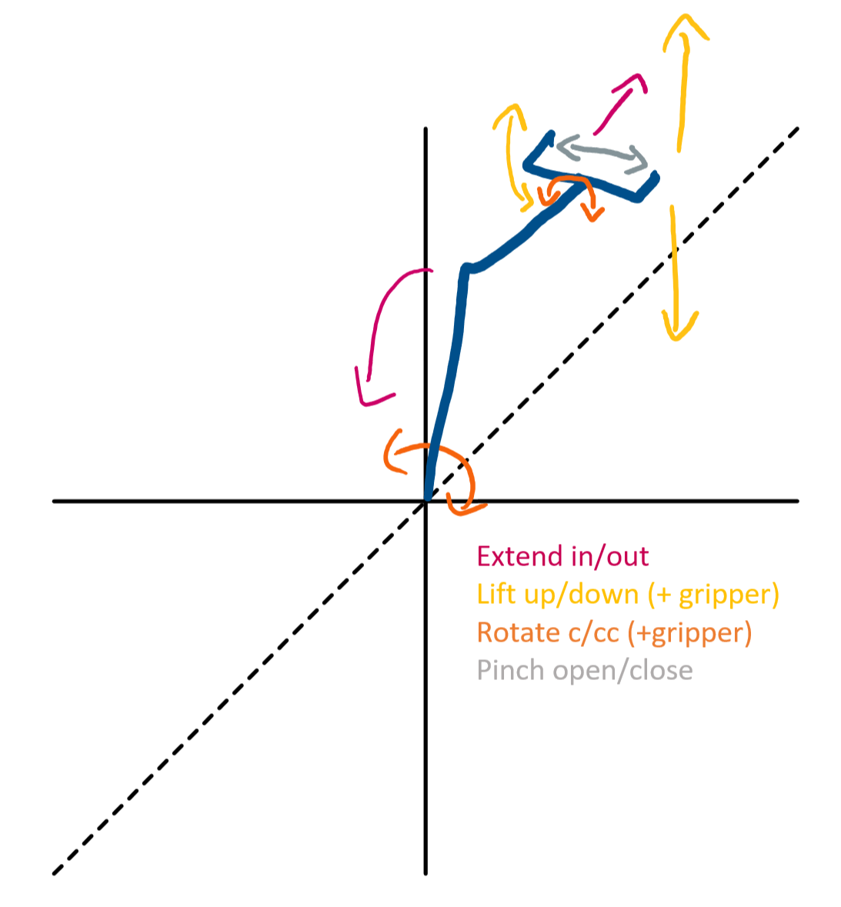
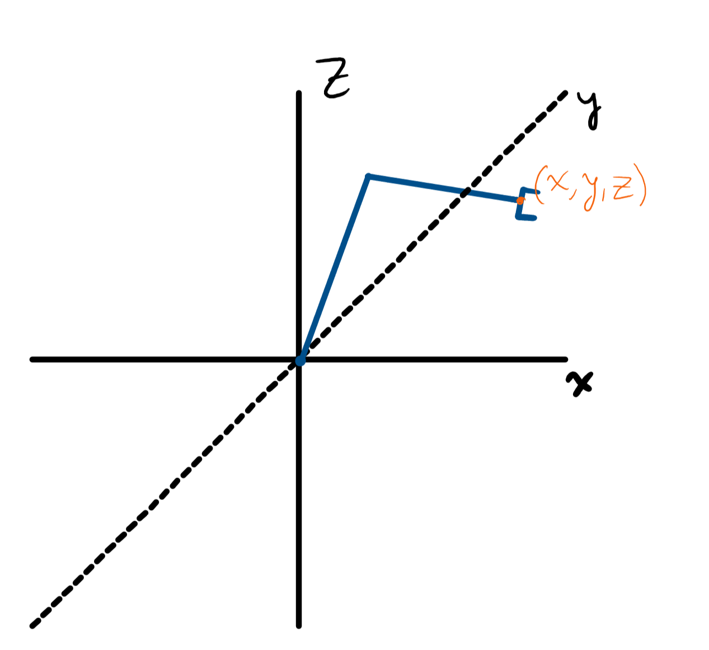
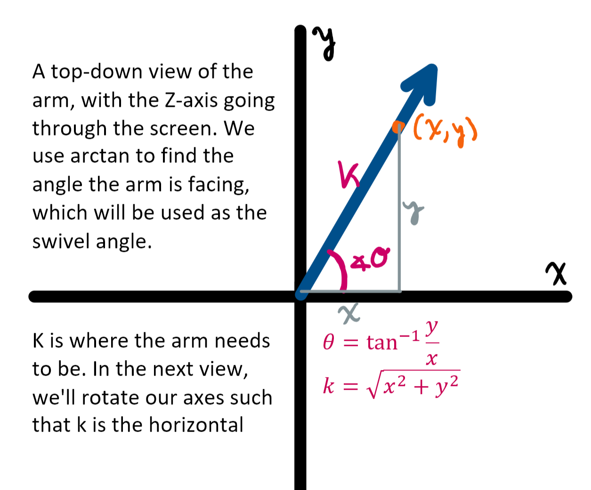
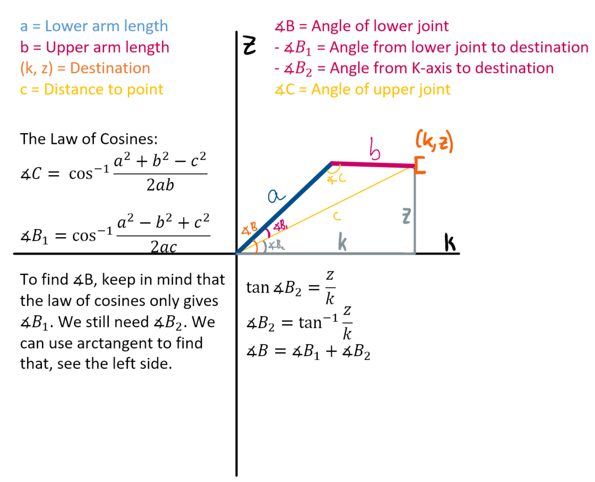

# ArmIK
Arm Inverse Kinematics.

## The Arm

The code here controls the arm, based on input from an Xbox controller. The arm
can swivel clockwise and counter-clockwise, lift up and down, and extend in and out. The gripper can be separately lifted up and down, rotated clockwise and counter-clockwise and pinch open and closed. The following image should illustrate that.



## Setup

There are two sketches in this repository: `Arm/Arm.ino` and `Gripper/Gripper.ino` for the arm and gripper boards, respectively. The sketches share a lot of common code, which is refactored away into libraries. Those libraries follow the naming conventions of `BURT_arm_X`, where `X` is the functionality offered by the library. 

To compile the sketches, the Arduino IDE needs to know where those libraries are. Unfortunately, to avoid compiling the arm and gripper sketches together, we can't simply place them in the same folder. But the only other path Arduino recognizes is the user's sketchbook directory. (You can find the path to your sketchbook by going to preferences. The libraries are located in `<sketchbook>/libraries`.) There are two options to get the sketches to compile: 

1. **Preferred** Create a hard link to the libraries in this repository. Each platform has a different way of doing this, but on Windows you can run the following command in the command prompt set to this repository:

```batch
for /d %i in (libraries\*) do (mklink /J %userprofile%\documents\arduino\%i %i)
```

2. **Workaround** Manually copy the directories in `/libraries` into your sketchbook. This would mean that changes to the libraries won't synchronize with the sketchbook and you'd need to re-copy the files every time. The hard link method avoids this by linking the libraries. 

## Code Details
### The controls

```  
ARM CONTROLS:
- arm swivel:				L (horizontal)
- arm lift:      		L (vertical)
- arm extend:       Bumpers
- precise swivel:		D-pad (horizontal)
- precise lift:     D-pad (vertical)
- precise extend:		Y/A

GRIPPER CONTROLS:
- gripper open:     Triggers
- gripper rotate:   R (horizontal)
- gripper lift:     R (vertical)
- precise open:  	  X/B

MISC:
- calibrate:        START
- driving mode:     BACK
```

This way, you can easily rotate and lift the arm (resulting in X and Y movement) at the same time by using the left joystick, or do the same for the gripper by using the right joystick. Using a “precise” control will move minimally to allow for precision movement along one axis at a time.

## The IK paradigm

Here is where IK, or **Inverse Kinematics**, comes in. Moving along the X-axis is done by swiveling, which rotates the arm in a circle. But when moving the arm along the Y- or Z-axis (lifting or extending), it would be convenient to move the joints in unison to keep the gripper level. We use [triangulation](https://www.researchgate.net/publication/251743615_Triangulation_A_new_algorithm_for_Inverse_Kinematics) to calculate the respective angles for both joints in order to move the arm to a specific point. Below is a diagram describing the process. The names for the sides and angles are used throughout the code. Also see the [interactive demo](https://www.desmos.com/calculator/i8grld5pdu).

Thing is, we want to compute the position in 3 dimensions, but triangulation only works in 2.



But we can take one dimension at a time. Let’s take a top-down view at the XY plane;

 

Now, we look back at a profile view, where k is the horizontal (the KZ plane): 



## The code

The Arduino script handles transforming the transmitted controller inputs into instructions for the motors. It does so by keeping track of the gripper’s position and updating it in small increments when the controls are pressed. When IK is involved, it calls `IK::calculateAngles` with the new position and passes the angles along to the motors. If needed, `IK::calculatePosition` can also calculate the position based on the angles. 

There are a few safety measures in place: 

- `IK::calculateAngles` uses `IK::calculatePosition` to double-check its work. If the difference falls out to be more than `IK::tolerance`, the operation fails and the arm doesn’t move. 
- `IK::calculateAngles` checks its results against `IK::bLimits` and `IK::cLimits` which dictate how far the joints can physically move due to hardware limitations. If the result comes out to be more than that, the operation fails and the arm doesn’t move
- The Arduino scripts only move the gripper by a small distance per second
- The Arduino scripts check the result of `IK::calculateAngles` against the current angles. If the difference comes out to be too much to move in a short time, the operation fails and the arm doesn’t move. 
