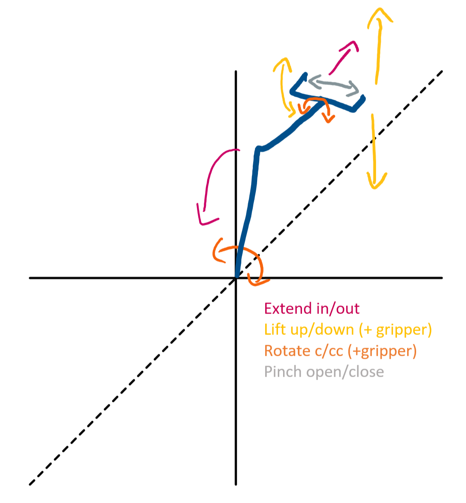
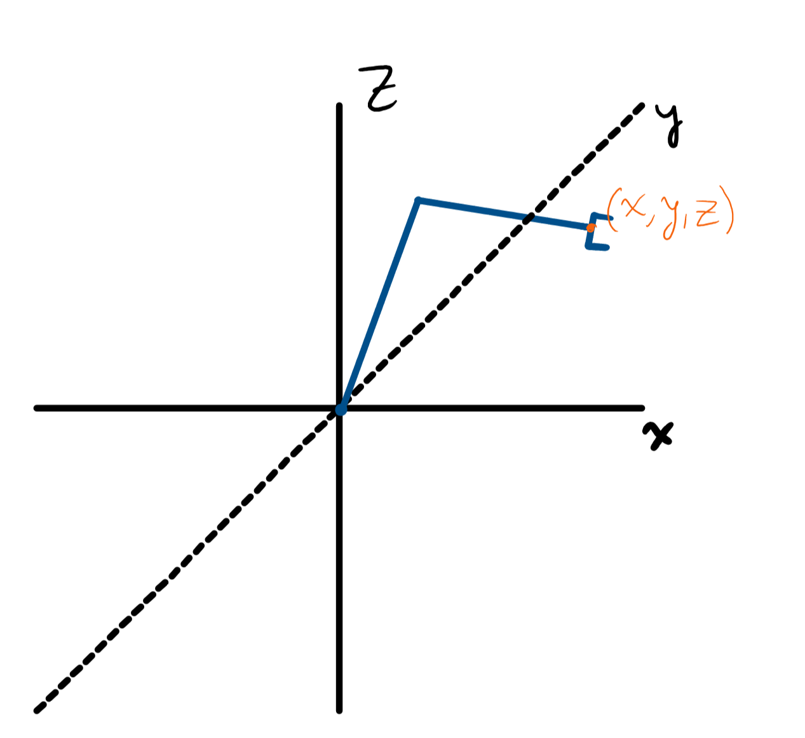
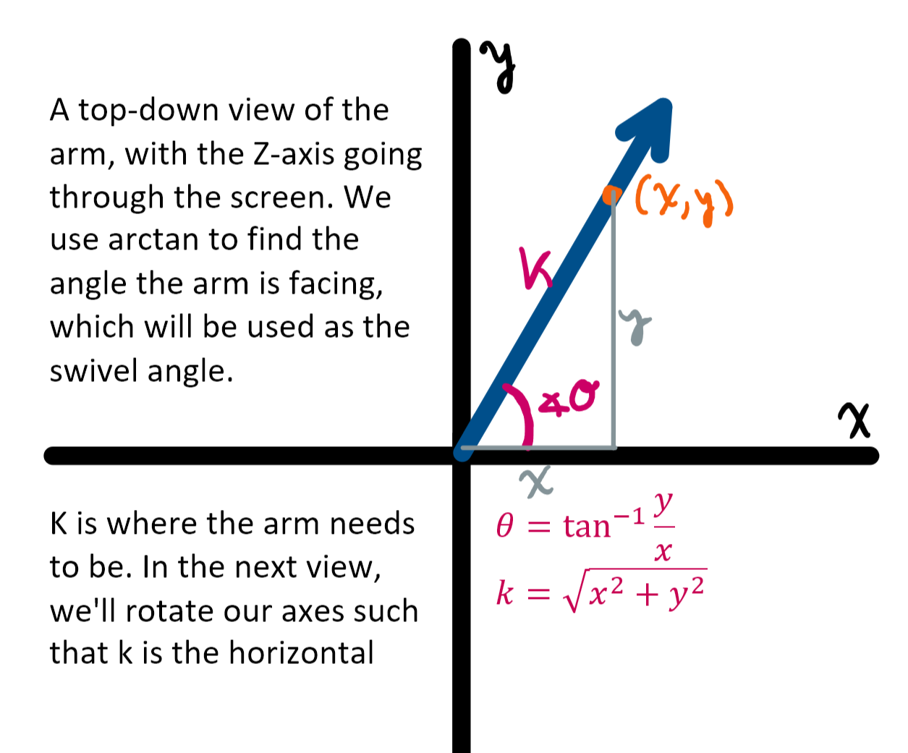
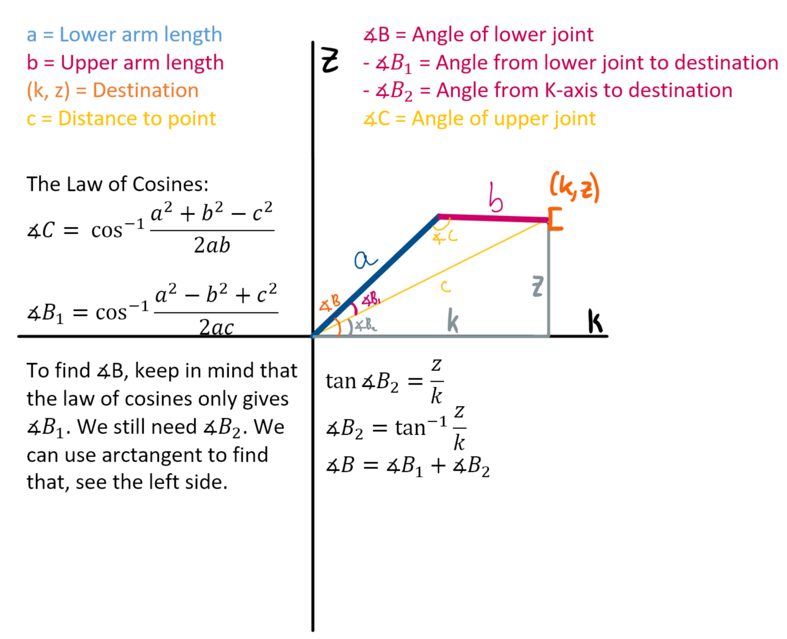

# Arm IK

## The Arm

The code here controls the arm, based on input from an Xbox controller. The arm
can swivel clockwise and counter-clockwise, lift up and down, and extend in and out. The gripper can be separately lifted up and down, rotated clockwise and counter-clockwise and pinch open and closed. The following image should illustrate that.

The arm has two modes: precision and IK. In precision mode, you move the joints individually by small increments. In IK mode, you control a reticle that determines the position of the gripper in 3D space. The system provides the translations between 3D coordinates and joint angles. 

## Inverse Kinematics

Here is where IK, or **Inverse Kinematics**, comes in. Moving along the X-axis is done by swiveling, which rotates the arm in a circle. But when moving the arm along the Y- or Z-axis (lifting or extending), it would be convenient to move the joints in unison to keep the gripper level. We use [triangulation](https://www.researchgate.net/publication/251743615_Triangulation_A_new_algorithm_for_Inverse_Kinematics) to calculate the respective angles for both joints to move the arm to a specific point. Below are some diagrams describing the process. The names for the sides and angles are used throughout the code. Also see the [interactive demo](https://www.desmos.com/calculator/a7dkvf6rpr).

We want to compute the position in 3 dimensions, but triangulation only works in 2.

But we can take one dimension at a time. Let’s take a top-down view at the XY plane;

 

Now, we look back at a profile view, where k is the horizontal (the KZ plane): 

